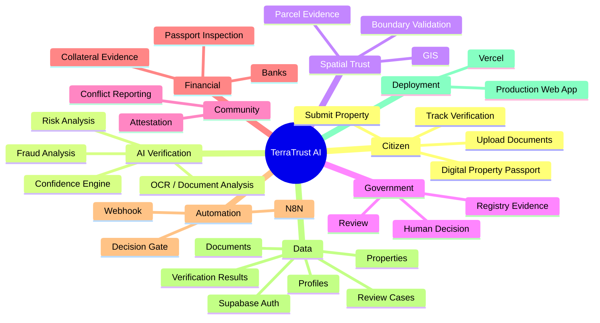
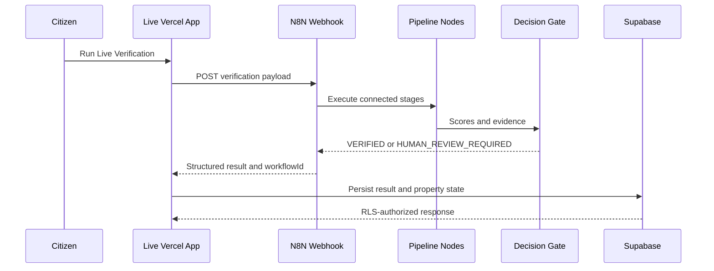
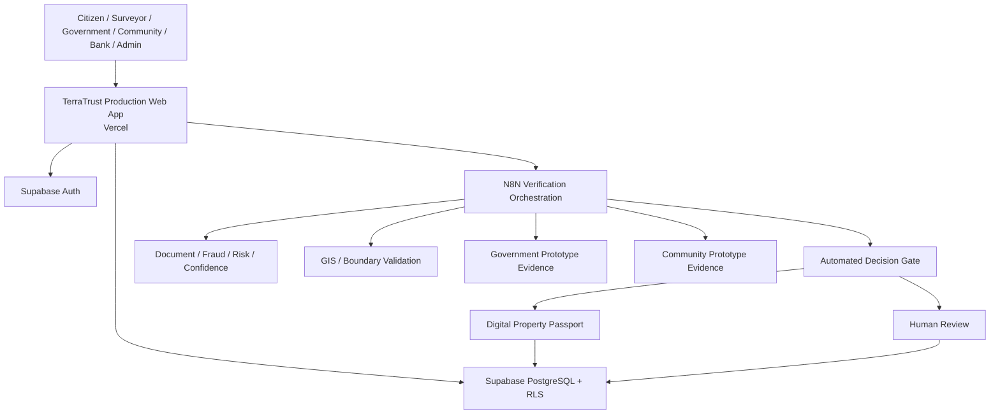
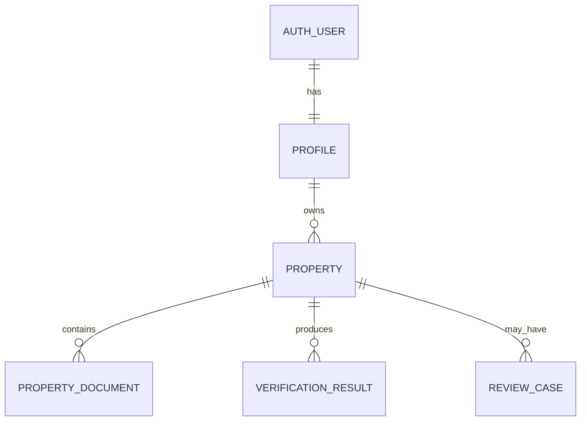
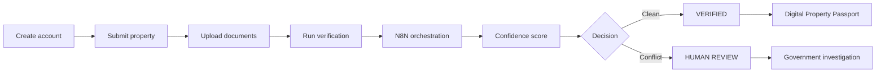

# TerraTrust AI

## AI-Powered Digital Property Trust & Verification Platform

> From fragmented land records to a machine-verifiable Digital Property Passport.

TerraTrust AI turns property documents, boundary evidence, risk signals, and human review into one explainable workflow. The production website uses Supabase for identity and persistence, N8N as the live verification orchestrator, and Vercel for public delivery.

**Live application:** [terratrust-ai.vercel.app](https://terratrust-ai.vercel.app)

## 🌍 The Problem

For many citizens, proving a property claim is more difficult than possessing a document. Evidence is distributed across paper files, maps, registries, survey plans, tax records, and community testimony.

That creates a human workflow full of uncertainty:

- ownership information is hard to reconcile;
- paper-heavy review is slow and inconsistent;
- forged or conflicting documents create fraud risk;
- boundaries may not match the claimed parcel;
- citizens, surveyors, government, communities, and banks lack a shared evidence view;
- disputes remain difficult to investigate and resolve.

## 💡 The TerraTrust Solution

TerraTrust gives each property an evidence-first verification journey:

```text
Citizen submits property
  -> Documents collected
  -> AI-assisted document analysis
  -> Fraud and risk analysis
  -> GIS / boundary validation
  -> Government prototype evidence
  -> Community prototype evidence
  -> Confidence score
  -> Automated decision
  -> Digital Property Passport or Human Review
```

The result is not a replacement for a government registry or legal title. It is an explainable trust layer that organizes evidence, highlights conflicts, and gives authorized reviewers a clear next step.

## 🧠 TerraTrust Mind Map



## ⚙️ How N8N Works

TerraTrust uses N8N as the orchestration layer for the verification pipeline. The live Vercel application posts the property payload to the configured webhook, N8N executes the connected stages, and the returned decision is rendered and persisted through Supabase.

```mermaid
flowchart LR
  A[Citizen submits property] --> B[TerraTrust Web App]
  B --> C[N8N Webhook]
  C --> D[Normalize Payload]
  D --> E[Document / OCR]
  E --> F[Fraud Analysis]
  F --> G[GIS / Boundary Verification]
  G --> H[Government Validation<br/>Prototype Registry Evidence]
  H --> I[Community Verification<br/>Prototype Evidence]
  I --> J[Risk Analysis]
  J --> K[Confidence Engine]
  K --> L{Automated Decision Gate}
  L -->|High confidence / clean| M[Issue Digital Property Passport]
  L -->|Conflict / risk / insufficient evidence| N[Human Review Required]
  M --> O[Return Verification Result]
  N --> O
  O --> P[TerraTrust UI]
  P --> Q[Supabase Persistence]
```



| Stage | What it does |
| --- | --- |
| Property Submitted | Receives the POST webhook request. |
| Normalize Payload | Extracts property, documents, IDs, and existing scores. |
| Document OCR | Scores document completeness and verification state. |
| Fraud Analysis | Detects elevated or critical conflict signals. |
| Boundary Verification | Checks whether boundary evidence is sufficiently formed. |
| Government Validation | Combines documents with prototype registry evidence. |
| Community Verification | Adds prototype attestations and objection signals. |
| Risk Analysis | Calculates a composite risk signal. |
| Confidence Engine | Aggregates weighted evidence into a confidence score. |
| Automated Decision Gate | Approves only when all required gates clear. |
| Issue Passport | Returns `VERIFIED` and `passportStatus: ready`. |
| Escalate to Human Review | Returns `HUMAN_REVIEW_REQUIRED` and `passportStatus: held`. |

## 🔄 End-to-End Data Flow



The demonstrated chain is:

```text
LIVE VERCEL
  -> REAL N8N WEBHOOK
  -> REAL N8N EXECUTION
  -> REAL DECISION
  -> REAL WEBSITE RESULT
  -> SUPABASE PERSISTENCE
```

## 🧪 N8N Demo Scenarios

| Scenario | Input | N8N result | Passport |
| --- | --- | --- | --- |
| Clean property | `p_001` / `TT-8421-LG` | `VERIFIED` with high confidence | Ready |
| Conflicted property | `p_003` / `TT-5512-AB` | `HUMAN_REVIEW_REQUIRED` | Held |
| Malformed request | Invalid or incomplete | Safe manual review | Held |

The live demonstration has produced confidence values of 93 for the clean property and 48 for the conflicted property. The decision and passport state are the important contract; scores may legitimately change as the workflow evolves.

## 🏗️ System Architecture



## ☁️ Vercel Production

Vercel hosts the production TanStack Start application, serves generated client assets, runs the server adapter, and connects production environment configuration.

```text
GitHub main -> Vercel build -> Public TerraTrust Web App -> Supabase + N8N
```

Production configuration uses these names only:

```text
VITE_SUPABASE_URL
VITE_SUPABASE_PUBLISHABLE_KEY
VITE_N8N_WEBHOOK_URL
```

No production values are stored in this repository.

## 🗄️ Supabase Data + Authentication

Supabase provides email/password authentication, profiles, PostgreSQL persistence, and RLS.



The lifecycle is `Auth User -> Profile -> Properties -> Documents -> Verification Results / Review Cases`. Owner policies allow users to access only records permitted by their authenticated identity and owned property relationship.

## 👥 Role Model

| Role | Purpose |
| --- | --- |
| Citizen | Submit and manage properties. |
| Surveyor | Review assignments and boundary workflows. |
| Government | Investigate property conflicts and review cases. |
| Community | Provide supporting verification evidence. |
| Bank | Inspect shared property passport information. |
| Admin | Manage platform and audit views. |

Each role receives a focused workspace and role-aware navigation.

## 📱 User Journey



## 🧑‍⚖️ Human-in-the-Loop Design

TerraTrust does not blindly automate disputed land decisions:

```text
AI detects -> AI evaluates -> Confidence calculated
  -> Clean evidence: automated outcome
  -> Conflicting evidence: human review
  -> Authorized reviewer investigates
```

Government and authorized human review remain the authority for disputed cases.

## 📊 What Is Actually Implemented

| Capability | Status |
| --- | --- |
| Supabase email/password authentication | ✅ Implemented |
| Role-based access and workspaces | ✅ Implemented |
| Property submission | ✅ Implemented |
| Document metadata | ✅ Implemented |
| Verification workflow UI | ✅ Implemented |
| Fraud analysis | ✅ Implemented |
| GIS/boundary validation | ✅ Implemented |
| Government registry evidence | 🟡 Prototype / deterministic evidence |
| Community verification evidence | 🟡 Prototype / deterministic evidence |
| Confidence scoring | ✅ Implemented |
| N8N orchestration | ✅ Implemented and production-tested |
| Automated decision gate | ✅ Implemented |
| Digital Property Passport | ✅ Implemented |
| Human review routing | ✅ Implemented |
| Supabase persistence and RLS | ✅ Implemented |
| Vercel production deployment | ✅ Implemented |
| Mobile responsive UI | ✅ Implemented |
| Live external government APIs | 🔜 Future integration |
| Live external community network | 🔜 Future integration |

## 🔐 Security

- Supabase Auth owns user sessions.
- RLS protects profiles, properties, documents, verification results, and review cases.
- Browser configuration uses only publishable Supabase and public webhook environment variables.
- The Supabase service-role key is never a `VITE_` variable and is never bundled.
- N8N credentials remain in N8N or server-side environment configuration.
- Live N8N failures return held/manual review rather than fabricated verified results.
- This repository intentionally contains no production secrets.

## 🚧 Current MVP Limitations

1. Government validation uses prototype registry evidence, not a live government API.
2. Community verification uses prototype evidence, not a live external community network.
3. Document upload currently persists metadata; binary file storage is not part of this MVP.
4. Notifications are session-scoped because there is no notification persistence table.
5. Demo properties and deterministic evidence are intentionally included for the hackathon walkthrough.
6. A Digital Property Passport is a prototype evidence record, not an official title certificate.

## 🧪 Demo Guide

### Demo A — Clean Property

1. Sign in as Citizen.
2. Open My Properties and select `p_001` / `TT-8421-LG`.
3. Run Live Verification.
4. Show the N8N stages, `VERIFIED`, and Passport Ready.
5. Open the property passport.

### Demo B — Conflict

1. Open `p_003` / `TT-5512-AB`.
2. Run Live Verification.
3. Show the conflict and risk evidence.
4. Show `HUMAN_REVIEW_REQUIRED` and Passport Held.
5. Open the Government review workflow.

See the [demo guide](docs/demo-guide.md) and [demo account identifiers](docs/demo-accounts.md). Passwords are intentionally not stored in this public repository.

## 📚 Documentation

- [Architecture](docs/architecture.md)
- [N8N Workflow](docs/n8n-workflow.md)
- [Supabase](docs/supabase.md)
- [Deployment](docs/deployment.md)
- [Security](docs/security.md)
- [Demo Guide](docs/demo-guide.md)
- [Demo Account Identifiers](docs/demo-accounts.md)
- [Supabase Setup](SUPABASE_SETUP.md)
- [Technical Documentation](DOCUMENTATION.md)
- [Workflow export](n8n/terratrust-verification-workflow.json)
- [Supabase migrations](supabase/migrations/)

## 🛠️ Local Development

Requirements: Bun, a Supabase project, and an N8N webhook for live verification.

```sh
git clone https://github.com/Kushh-Santhosh/TerraTrust-AI.git
cd TerraTrust-AI
bun install
cp .env.example .env.local
bun run dev
```

Set the placeholder variables in `.env.local`:

```env
VITE_SUPABASE_URL=your_supabase_project_url
VITE_SUPABASE_PUBLISHABLE_KEY=your_supabase_publishable_key
VITE_N8N_WEBHOOK_URL=your_n8n_webhook_url
```

Use `bun run lint` and `bun run build` for checks. Never add `.env.local` or service-role credentials to Git.

## 📁 Project Structure

```text
src/                  React routes, components, engines, and integrations
  components/         Shared UI and layout
  routes/             TanStack file routes and role workspaces
  lib/                Auth, Supabase, N8N, scoring, and persistence
api/                  Vercel server adapter
n8n/                  Exported TerraTrust verification workflow
supabase/migrations/  PostgreSQL schema and RLS policies
docs/                 Architecture, deployment, security, and demo docs
```

## 🔗 Technology Stack

| Area | Technology |
| --- | --- |
| Frontend | React, TypeScript, TanStack Start/Router, Vite, Tailwind CSS |
| Data and auth | Supabase Auth, PostgreSQL, Row-Level Security |
| Automation | N8N |
| Deployment | Vercel |
| Verification | Document, fraud, risk, confidence, and decision engines |
| Mapping | GIS-style parcel and boundary evidence |

## 🏆 Why TerraTrust

TerraTrust is not simply a document upload tool. It is a trust layer connecting citizens, surveyors, government, communities, and banks through verified evidence, spatial validation, AI-assisted analysis, N8N orchestration, human review, and a Digital Property Passport.

The long-term vision is interoperable digital property trust infrastructure: fragmented property records becoming structured, explainable, reviewable evidence. The current system is a working prototype and makes no claim of national deployment or government adoption.
