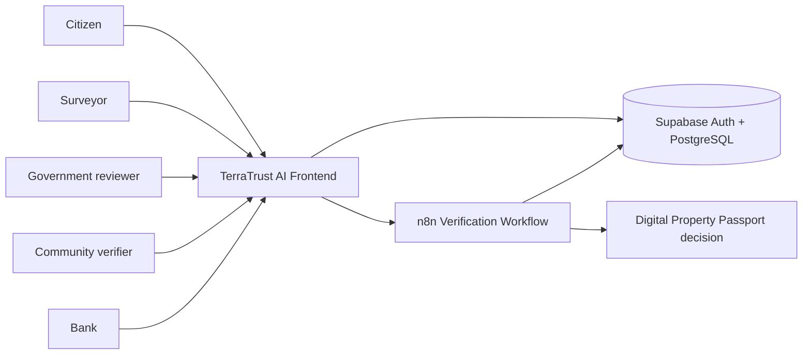

# TerraTrust AI

AI-assisted digital property verification and trust infrastructure.

TerraTrust AI brings property records, documents, boundary evidence, risk signals, and human review into one explainable workflow that produces a machine-readable **Digital Property Passport**.

## The Problem

Land evidence is often fragmented across documents, maps, registries, and on-ground testimony. That makes ownership and boundary review slow, inconsistent, and vulnerable to conflict or fraud.

## Our Solution

TerraTrust organizes available evidence into a clear verification flow. It does not replace a government registry or legally establish title.

```text
Property
  -> Documents / OCR
  -> Fraud checks
  -> GIS boundary evidence
  -> Government prototype evidence
  -> Community prototype evidence
  -> Risk + confidence
  -> Verified Passport or Human Review
```

## Architecture



The TanStack/Vite application remains at the repository root because its aliases, generated route tree, and build configuration depend on that layout. Infrastructure is separated by responsibility:

- `src/` - frontend routes, components, hooks, business logic, and integrations
- `n8n/` - the exported verification workflow
- `supabase/` - PostgreSQL migrations and RLS policies
- `docs/` - focused demo documentation

## User Roles

Citizen, Surveyor, Government reviewer, Community verifier, Bank, and Admin each have a focused workspace and minimal primary navigation.

## Demo

- **p001 / TT-8421-LG:** clean evidence, live n8n result `VERIFIED`, confidence `93`, Passport Ready.
- **p003 / TT-5512-AB:** conflicting evidence, live n8n result `HUMAN_REVIEW_REQUIRED`, confidence `48`, Passport Held.
- **Malformed input:** safe human-review response; no passport is issued.

See [docs/demo-guide.md](docs/demo-guide.md) for the judge walkthrough.

## Tech Stack

React 19, TanStack Start/Router, Vite, TypeScript, Tailwind CSS, Supabase Auth/PostgreSQL/RLS, and n8n.

## Run Locally

Requirements: Bun, a Supabase project for live auth/data, and a configured n8n webhook for live verification.

```sh
bun install
cp .env.example .env.local
bun run dev
```

Set local values in `.env.local`:

```env
VITE_SUPABASE_URL=https://your-project-ref.supabase.co
VITE_SUPABASE_PUBLISHABLE_KEY=your_publishable_key_here
VITE_N8N_WEBHOOK_URL=https://your-n8n-host/webhook/terratrust/verify
```

Useful checks:

```sh
bun run lint
bun run build
```

Only `.env.example` belongs in Git. Never expose service-role keys, database passwords, OAuth secrets, or private API credentials in browser code.

## Important Prototype Note

Government and community stages currently use deterministic prototype evidence, not live government or community APIs. The Passport is a prototype evidence record, not an official title certificate. If live n8n verification is unavailable, the app labels the demo fallback and does not issue or persist a live verification result.

## Documentation

- [Supabase setup](SUPABASE_SETUP.md)
- [Technical documentation](DOCUMENTATION.md)
- [Demo guide](docs/demo-guide.md)
- [n8n workflow](n8n/terratrust-verification-workflow.json)
- [Supabase migrations](supabase/migrations/)

## Team

Team Fensta
