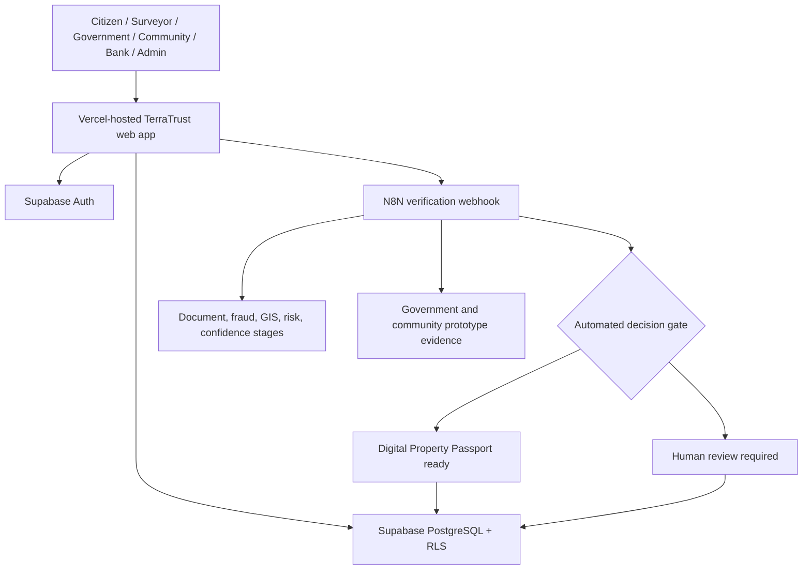

# TerraTrust AI Architecture

TerraTrust is a role-aware property trust workflow. The web application coordinates evidence collection, live N8N verification, Supabase persistence, and human review without presenting a property record as legal title.

## System Boundary

## Request Lifecycle

1. A signed-in user opens a property workflow in the React/TanStack application.
2. The client sends the property payload to `VITE_N8N_WEBHOOK_URL`.
3. N8N runs the ten-stage verification graph and returns a structured decision.
4. The client renders the steps and persists verified results or review cases through Supabase RLS.
5. The clean path produces a ready passport; conflicted evidence remains held for review.

## Role Workspaces

| Role | Workspace | Primary responsibility |
| --- | --- | --- |
| Citizen | `/dashboard` | Submit properties, manage evidence, inspect passports |
| Surveyor | `/surveyor` | Review assignments and boundary work |
| Government | `/government` | Investigate conflicts and review cases |
| Community verifier | `/verification` | Provide supporting attestations or objections |
| Bank | `/bank` | Inspect shared passport evidence |
| Admin | `/admin` | Platform administration and audit views |

## Real and Prototype Components

- **Real integrations:** Supabase Auth/PostgreSQL/RLS, N8N webhook execution, Vercel hosting.
- **Implemented application engines:** fraud, risk, confidence, valuation, property intelligence, and GIS-style boundary evidence.
- **Prototype evidence:** government registry and community verification stages inside N8N. They are deterministic evidence, not live external registry APIs.

See [N8N workflow](n8n-workflow.md) and [Supabase](supabase.md) for contract details.
