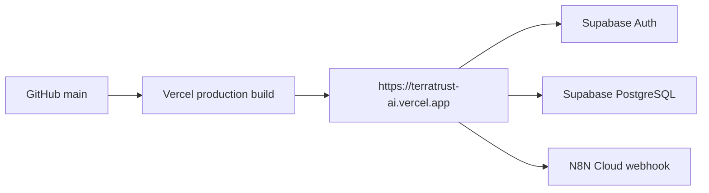

# Production Deployment

TerraTrust is deployed as a TanStack Start/Vite application on Vercel.



## Production URL

[Open TerraTrust AI](https://terratrust-ai.vercel.app)

## Build and Routing

Vercel runs `rm -rf dist && vite build` and serves `dist/client`. The Vercel configuration handles `/assets/*` before the application catch-all, so generated CSS and JavaScript are served as static files. Application routes are forwarded to the TanStack server adapter in `api/index.ts`.

## Environment Configuration

Production requires these names:

```text
VITE_SUPABASE_URL
VITE_SUPABASE_PUBLISHABLE_KEY
VITE_N8N_WEBHOOK_URL
```

Values are configured in Vercel and are intentionally omitted from this repository. The Supabase service-role key, when needed for local administration, is server-side only and is never a `VITE_` variable.

## Release Checklist

1. Run a clean `bun run build`.
2. Run `bun run lint`.
3. Check `git diff --check` and scan for secrets.
4. Push the final commit to `main`.
5. Deploy the same source to Vercel production.
6. Open the public URL and test login, N8N verification, persistence, and mobile layout.
