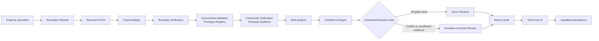

# N8N Verification Workflow

TerraTrust uses N8N as the orchestration layer for the verification pipeline. The production website posts a property payload to the configured `VITE_N8N_WEBHOOK_URL`; no webhook secret or credential is stored in the frontend.

## Production Flow



## Stages

| Stage | Implemented behavior |
| --- | --- |
| Property Submitted | Receives the POST webhook payload. |
| Normalize Payload | Extracts property, documents, IDs, and existing scores. |
| Document OCR | Calculates document confidence and requires at least one fully verified document. |
| Fraud Analysis | Assigns fraud score/band; disputed evidence becomes critical. |
| Boundary Verification | Scores boundary evidence and requires at least three vertices. |
| Government Validation | Combines document and prototype registry evidence. |
| Community Verification | Produces supporting prototype attestations and detects objections. |
| Risk Analysis | Calculates composite risk and registry cross-check state. |
| Confidence Engine | Applies weighted evidence scoring. |
| Automated Decision Gate | Requires confidence, fraud, boundary, document, government, community, and risk gates. |
| Issue Passport | Returns `VERIFIED`, `status: verified`, and `passportStatus: ready`. |
| Escalate to Human Review | Returns `HUMAN_REVIEW_REQUIRED`, `status: manual_review`, and `passportStatus: held`. |

## Response Contract

The application consumes these fields when returned by N8N:

```json
{
  "workflowId": "WF-N8N-...",
  "propertyId": "p_001",
  "passportId": "TT-8421-LG",
  "decision": "VERIFIED",
  "status": "verified",
  "confidence": 93,
  "fraudStatus": "Clear",
  "passportStatus": "ready",
  "steps": []
}
```

The client validates that a live response contains property and passport identifiers plus a decision/status. If N8N is configured but unavailable or invalid, the client returns a held/manual-review state with null scores and does not persist it as a live result. Local simulation is available only when no webhook is configured.

## Demonstration Scenarios

| Scenario | Result |
| --- | --- |
| `p_001` / `TT-8421-LG` | `VERIFIED`, high confidence, passport ready |
| `p_003` / `TT-5512-AB` | `HUMAN_REVIEW_REQUIRED`, lower confidence, passport held |
| Incomplete request | Safe manual review response, passport held |

## Persistence

After a successful live response, the client resolves the property by its Supabase UUID or passport ID under the signed-in owner. It writes the verification result, opens or resolves a review case, and updates the property status through RLS-protected Supabase requests.

Government and community nodes are prototype evidence stages. N8N orchestration, the webhook execution, response contract, and Supabase persistence are the real integration path.
