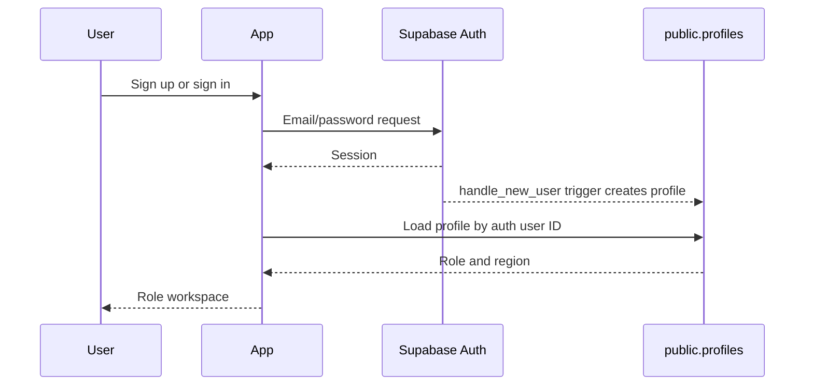

# Supabase Data and Authentication

Supabase provides TerraTrust authentication, profiles, PostgreSQL persistence, and row-level security. Browser code uses only the project URL and publishable key through Vite environment variables.

## Data Model

```mermaid
erDiagram
  AUTH_USER ||--|| PROFILE : has
  PROFILE ||--o{ PROPERTY : owns
  PROPERTY ||--o{ PROPERTY_DOCUMENT : contains
  PROPERTY ||--o{ VERIFICATION_RESULT : produces
  PROPERTY ||--o{ REVIEW_CASE : may_have

  PROFILE {
    uuid id PK
    text full_name
    text email
    text role
    text region
  }
  PROPERTY {
    uuid id PK
    uuid owner_id FK
    text property_name
    text passport_id UK
    jsonb location
    numeric area
    text status
    integer trust_score
  }
  PROPERTY_DOCUMENT {
    uuid id PK
    uuid property_id FK
    text name
    text kind
    boolean verified
  }
  VERIFICATION_RESULT {
    uuid id PK
    uuid property_id FK
    text provider
    jsonb result
  }
  REVIEW_CASE {
    uuid id PK
    uuid property_id FK
    text status
    text reason
  }
```

## Authentication Lifecycle

Normal signups default to `citizen`. Email confirmation is handled by the configured Supabase project; when confirmation is required there is no browser session yet, so the database trigger is the profile creation path.

## Row-Level Security

All five public tables have RLS enabled. Policies scope profile access to `auth.uid()` and scope property-related records through the owning property. Owners can select, insert, and update their own records; another authenticated user cannot read or modify those records.

The migration sources are in `supabase/migrations/001_initial_schema.sql` and `002_persistence_update_policies.sql`.

## Verification Persistence

A live N8N result is stored in `verification_results`. A verified result updates the owned property to `verified`; a manual-review result creates or updates an open `review_cases` row and keeps the passport held. Failed live calls are not persisted as successful verification results.

Document uploads currently persist metadata such as filename and kind. Binary storage integration is not part of this MVP.
